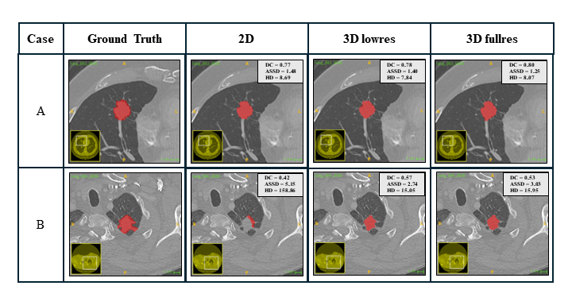

# Lung Cancer Segmentation using nnU-Net

## Overview
This repository contains work related to preparing a dataset and training models for lung cancer segmentation using the NSCLC Radiogenomics dataset. The nnU-Net framework was utilized for model training.

## Method

### CT Acquisition
The work utilized the NSCLC Radiogenomics dataset, which comprises CT and PET/CT images of 211 subjects with Non-Small Cell Lung Cancer (NSCLC). The dataset included semantic annotations and segmentation maps, but only the CT images were used in this study to integrate with transcriptome expression levels and understand tumor heterogeneity.

****Dataset****
The NSCLC Radiogenomics dataset is available at: [https://www.cancerimagingarchive.net/collection/nsclc-radiogenomics/](https://www.cancerimagingarchive.net/collection/nsclc-radiogenomics/)

### Dataset Preparation
The original dataset had 96 CT images, but 19 were excluded due to errors, leaving 77 usable CT images with segmentation data. These were converted from DICOM to Nifti files. Alignment mismatches required adjustments, resulting in a dataset of 77 cases with aligned CT images and segmentation masks.

### nnU-Net Framework
The nnU-Net framework, known for its autonomous configuration capabilities in medical image segmentation, was used. It automates data preprocessing, network architecture determination, training procedures, and post-processing.

****nnU-Net github repository****
 [https://github.com/MIC-DKFZ/nnUNet](https://github.com/MIC-DKFZ/nnUNet)

### Data Preprocessing
The dataset was split into 62 training and 15 testing cases following nnU-Net guidelines. Data was arranged into specific sub-directories, and preprocessing provided three U-Net configurations: 2D, 3D low resolution, and 3D full resolution.

### Model Training
The nnU-Net framework trained models using the preprocessed data across the three configurations. These models then predicted tumor segmentations for the test set CT images.

## Results
The models trained on 2D, 3D low resolution (3D lowres), and 3D full resolution (3D fullres) configurations were evaluated using Dice Score, average symmetric surface distance (ASSD), and Hausdorff distance. The 2D model performed poorly, often failing to predict segmentations, resulting in the lowest mean Dice Score (0.38) and the highest mean ASSD (68.64) and Hausdorff distance (182.42). Among the 3D models, the 3D lowres model outperformed the 3D fullres model, achieving the highest mean Dice Score (0.62), the lowest mean ASSD (8.78), and the lowest mean Hausdorff distance (31.48), making it the most effective configuration for segmentation in this work.

Qualitative visualization of two cases from the testing set shows ground truth tumor segmentations alongside those predicted by the models trained with 2D, 3D low resolution (3D lowres), and 3D full resolution (3D fullres) configurations.

## Usage
### Dataset Preparation
1. Convert DICOM files to corresponding volumetric Nifti images, maintaining the same file order as in the NSCLC Radiogenomics dataset, using the `dataset_preparation/dicom_to_nifti_converter.py` Python script.
2. Manually clean the dataset by removing PET scans and cases with dimension mismatches between the original image and segmentation mask.
3. Manually convert segmentation DICOMs to Nifti using ITKSnap software.
4. Generate segmentation masks using the `dataset_preparation/segmentation_mask_generator.py` script.
5. Rearrange the dataset with segmentation masks and original images under case files using the `dataset_preparation/Dataset_rearrange.ipynb` notebook.
6. Prepare the dataset for nnU-Net using the `dataset_preparation/nnunet_dataset_raw_preparation.py` script.

### Model Training
1. Set up the local PC to run nnU-Net as mentioned in the [nnU-Net installation instructions](https://github.com/MIC-DKFZ/nnUNet/blob/master/documentation/installation_instructions.md).
2. Prepare the dataset according to the file structure described in the [nnU-Net dataset format documentation](https://github.com/MIC-DKFZ/nnUNet/blob/master/documentation/dataset_format.md). The `dataset_preparation/dataset.json` file that should be created under nnU-Net_raw has been created manually.
3. Train the models using the instructions in the [nnU-Net usage documentation](https://github.com/MIC-DKFZ/nnUNet/blob/master/documentation/how_to_use_nnunet.md). The `model_training.ipynb` notebook was used to train the models on a cluster.

### Evaluation
The predicted segmentations were evaluated using the `evaluation_results.py` script.
